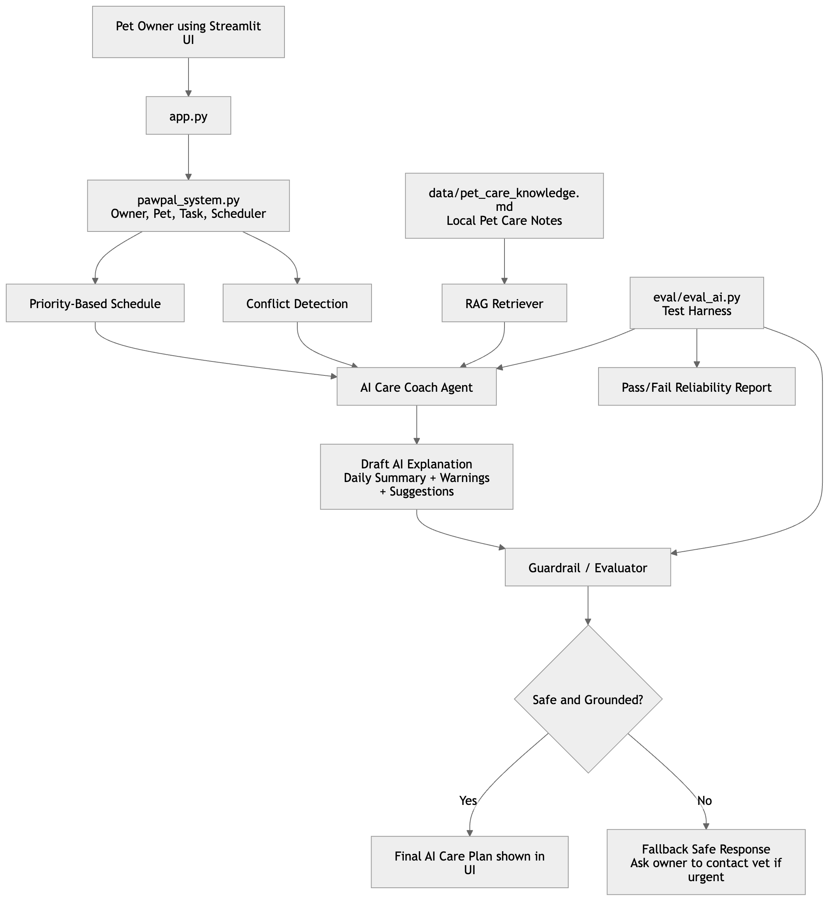
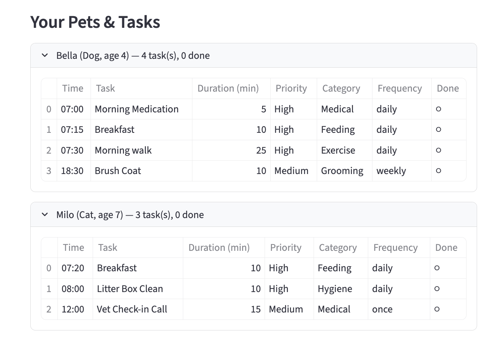
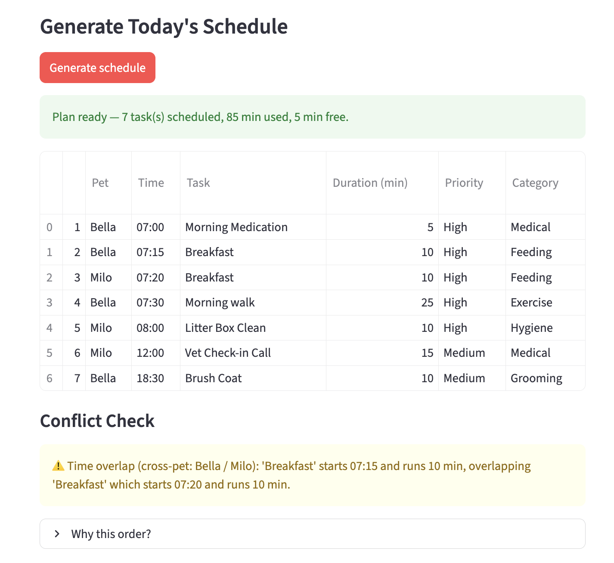
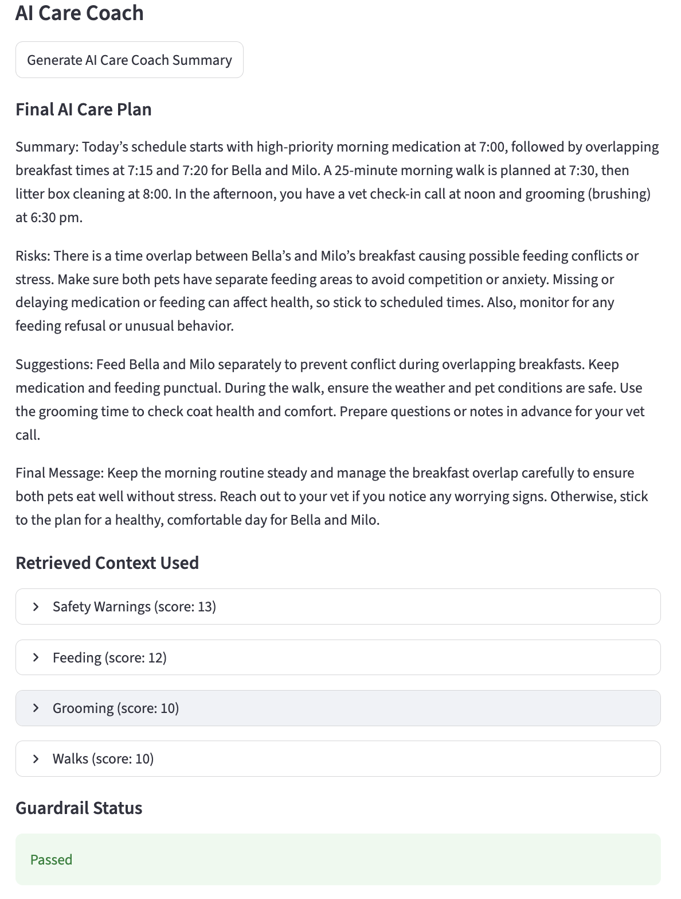

# PawPal+ AI Care Coach

PawPal+ AI Care Coach is a pet care planning system that combines classic Python scheduling logic with a lightweight applied AI workflow. It helps a pet owner organize daily care tasks, explain scheduling decisions, retrieve relevant pet-care guidance from a local knowledge base, and present a guardrailed plain-English care summary that stays safe enough for demo and grading use.

## Original Project: PawPal+

PawPal+ was my original Modules 1-3 project. It focused on object-oriented design and a Streamlit interface for managing pets and daily care tasks, then generating a schedule that prioritizes important work such as feeding, walks, medication, and appointments.

The original system emphasized OOP structure, task prioritization, recurrence, filtering, and conflict detection. Core behaviors were implemented in `pawpal_system.py` and surfaced through a simple interactive UI in `app.py`.

## Final AI Extension

The final extension turns the original planner into **PawPal+ AI Care Coach**. After the schedule is generated, the AI workflow reviews scheduled tasks and conflict warnings, retrieves relevant sections from `data/pet_care_knowledge.md`, produces a concise plain-English care plan, and runs guardrails before showing the final output.

This design keeps the new AI behavior integrated into the main app rather than separated into a demo-only script. It also preserves reproducibility by supporting a deterministic fallback when no `OPENAI_API_KEY` is available.

## Architecture Overview

The system diagram is available in [diagram.md](/Users/kaungmyatnaing/GitRepo/applied-ai-system-project/diagram.md:1), and a rendered version is included at [assets/architecture.png](/Users/kaungmyatnaing/GitRepo/applied-ai-system-project/assets/architecture.png).

Data flow:

`User input -> Streamlit UI -> PawPal scheduler -> RAG retriever -> AI Care Coach -> guardrail evaluator -> final output`

In practice, the owner adds pets and tasks in `app.py`, the scheduling engine in `pawpal_system.py` generates the daily plan and conflict warnings, `ai/retriever.py` pulls matching knowledge from the local markdown file, `ai/care_coach.py` drafts the care summary, and `ai/guardrails.py` validates the result before it is displayed. The AI workflow is also exercised separately by [eval/eval_ai.py](/Users/kaungmyatnaing/GitRepo/applied-ai-system-project/eval/eval_ai.py:1).

## Screenshots

Architecture:



Assigned tasks in the Streamlit UI:



Generated schedule showing sorting and scheduling behavior:



AI Care Coach output using retrieved context:



## Repository Structure

```text
pawpal-plus-ai/
├── app.py
├── pawpal_system.py
├── requirements.txt
├── README.md
├── diagram.md
├── ai/
│   ├── __init__.py
│   ├── care_coach.py
│   ├── retriever.py
│   ├── guardrails.py
│   └── prompts.py
├── data/
│   └── pet_care_knowledge.md
├── eval/
│   ├── eval_ai.py
│   └── eval_cases.json
├── tests/
│   ├── test_pawpal.py
│   ├── test_retriever.py
│   └── test_guardrails.py
└── assets/
    ├── architecture.png
    ├── assigned_tasks.png
    ├── generate_schedule.png
    └── AI_coach.png
```

## Setup Instructions

Clone the repository and set up a local environment:

```bash
git clone <your-repo-url>
cd applied-ai-system-project
python -m venv .venv
source .venv/bin/activate
pip install -r requirements.txt
```

Run the Streamlit app:

```bash
streamlit run app.py
```

Run the test suite:

```bash
python -m pytest tests -q
```

Run the AI evaluation harness:

```bash
python eval/eval_ai.py
```

### Optional OpenAI API Key

`OPENAI_API_KEY` is optional. If you want to try the optional model-backed summary path, place your key in a root `.env` file:

```env
OPENAI_API_KEY=your_openai_api_key_here
```

If no API key is provided, the system still works using the deterministic fallback path in `ai/care_coach.py`. That fallback is important for reproducible grading because it avoids requiring paid API access.

## Demo Flow

1. Run `streamlit run app.py`.
2. Add an owner and 1 to 2 pets.
3. Add 2 to 3 tasks, including one medication task.
4. Click `Generate schedule`.
5. Show the scheduled tasks, skipped tasks, and conflict warnings.
6. Click `Generate AI Care Coach Summary`.
7. Show the final AI care plan, retrieved context, and guardrail status.
8. Run `python eval/eval_ai.py`.
9. Show the final evaluation result ending with `Final Score: 3/3 passed`.

## Sample Interactions

### A. Normal Routine: Feeding + Walk

Input:

- Pet: Bella, dog, age 4
- Tasks:
  - `Breakfast`, `07:30`, high priority, feeding
  - `Morning Walk`, `08:00`, high priority, exercise

Retrieved context used:

- `Feeding`
- `Walks`

AI output summary:

```text
Summary: The day includes 2 scheduled care tasks. High-priority tasks scheduled first included Breakfast, Morning Walk.
Risks: No schedule conflicts were detected.
Suggestions: Keep meals consistent and monitor appetite changes. Plan walks around safe weather and temperature conditions.
```

Guardrail result:

- Passed

### B. Medication Task

Input:

- Pet: Bella, dog, age 4
- Tasks:
  - `Morning Medication`, `07:00`, high priority, medical
  - `Breakfast`, `07:15`, high priority, feeding

Retrieved context used:

- `Medication`
- `Feeding`
- `Vet Appointments`

AI output summary:

```text
Summary: The day includes 2 scheduled care tasks. High-priority tasks scheduled first included Morning Medication, Breakfast.
Risks: No schedule conflicts were detected.
Suggestions: Keep medication tasks on time and contact a veterinarian before making any dose changes. Keep meals consistent and monitor appetite changes.
```

Guardrail result:

- Passed

### C. Overloaded or Conflicting Schedule

Input:

- Pet: Bella, dog, age 4
- Tasks:
  - `Morning Walk`, `07:00`, high priority, exercise, 30 min
  - `Breakfast`, `07:10`, high priority, feeding, 15 min
  - `Vet Appointment`, `08:00`, high priority, medical, 60 min
- Conflict warnings:
  - time overlap
  - budget overflow

Retrieved context used:

- `Safety Warnings`
- `Walks`
- `Feeding`
- `Vet Appointments`

AI output summary:

```text
Summary: The day includes 3 scheduled care tasks. High-priority tasks scheduled first included Morning Walk, Breakfast, Vet Appointment.
Risks: WARNING — Time overlap ... ; WARNING — Budget overflow ...
Suggestions: Treat overlaps and missed care as risks that should be resolved before the day starts. Do not skip veterinary follow-ups when symptoms or appointments are involved.
```

Guardrail result:

- Passed

## Design Decisions

This project uses a local markdown RAG approach instead of a vector database because the knowledge base is small, the retrieval behavior needs to be reproducible, and the architecture needs to stay easy to explain in a live demo. A simple keyword-based retriever is less powerful than embeddings, but it is transparent, lightweight, and stable.

The AI Care Coach includes a deterministic fallback instead of requiring an API key because the project must run reliably in grading environments. That fallback guarantees an end-to-end output even if network access, API access, or the optional `openai` package is unavailable.

Guardrails were added because pet health guidance can be sensitive. The app should not diagnose pets, tell owners to change medication dosage, or suggest ignoring a veterinarian. For urgent or medical concerns, it should recommend contacting a veterinarian instead.

The `ai/` folder keeps retrieval, prompting, orchestration, and safety checks separate from the scheduling logic in `pawpal_system.py`. This makes the code easier to test and keeps the original OOP planner cleanly separated from the applied AI extension.

`pytest` and the evaluation harness were both included for reliability. Unit tests verify scheduler logic, retrieval behavior, and guardrails, while `eval/eval_ai.py` checks the end-to-end AI workflow on representative scenarios.

Trade-offs:

- The local knowledge base is small.
- The app does not connect to a real veterinary database.
- There is no persistent application database.
- Keyword retrieval is simpler and easier to test, but less powerful than embedding-based retrieval.

## Testing Summary

22 unit tests passed and the AI evaluation harness passed 3 out of 3 scenarios. The system handled normal routines, medication-related tasks, and overloaded/conflicting schedules. The main limitation is that retrieval quality depends on the small local knowledge base.

What worked well:

- Priority-based scheduling and conflict detection remained stable after the AI extension.
- The retriever consistently pulled medication, feeding, walk, and safety sections for common tasks.
- The deterministic fallback kept the full system runnable without API credentials.

What did not work perfectly:

- Retrieval quality is only as good as the headings and keywords in the local markdown file.
- Guardrails are rule-based, so they may miss edge-case unsafe wording not covered by the patterns.
- The model-backed path is optional and intentionally not required for grading.

What I learned:

- Applied AI features are easier to defend when the non-AI baseline is already strong.
- Small local evaluation loops catch reliability issues earlier than relying on a UI demo alone.

## Reliability and Evaluation

Reliability in this project comes from several layers rather than a single model call.

- Automated tests: `tests/test_pawpal.py`, `tests/test_retriever.py`, and `tests/test_guardrails.py` validate scheduling, retrieval, and safety behavior.
- Guardrails: `ai/guardrails.py` blocks responses that suggest dosage changes, diagnoses, ignoring veterinarians, unsafe advice, or empty/weak output.
- Deterministic fallback: `ai/care_coach.py` can generate a safe structured response without any API key.
- Evaluation harness: `eval/eval_ai.py` runs three end-to-end scenarios and reports pass/fail results.
- Error handling: the optional OpenAI path is wrapped so missing API keys or a missing `openai` package simply fall back to the deterministic path rather than crashing the app.

The system does not claim a confidence score because one is not implemented.

## Reflection and Ethics

This system has clear limitations. The knowledge base is small, local, and manually written, so the advice it surfaces is narrow and potentially biased toward the examples and wording included in `data/pet_care_knowledge.md`. Because retrieval is keyword-based, it may also miss relevant context when task wording differs from the expected terms.

The AI could be misused if a user treated it like a veterinary diagnostic tool. To reduce that risk, the design intentionally avoids diagnosis, blocks dosage-change advice through guardrails, and pushes urgent or medical concerns back to a veterinarian. Ethically, that boundary is important because pet health advice can affect real animals.

One thing that surprised me while testing reliability was how much value came from the deterministic fallback. Even without API access, the system still produced coherent, testable outputs, which made the project much easier to demo and evaluate consistently.

I collaborated with AI as a coding and design assistant rather than as an authority on veterinary advice. AI was helpful for structuring the applied AI workflow, suggesting modular separation between retrieval and guardrails, and improving the clarity of documentation and evaluation steps.

One helpful AI suggestion was to keep the retriever deterministic and local instead of adding unnecessary infrastructure. That made the project easier to explain and more stable for grading.

One flawed AI suggestion was the temptation to make the assistant sound more medically confident than it should. That had to be corrected by enforcing stricter guardrails and clearer ethical framing.

The final ethical rule for this project is simple: the app should not diagnose pets or tell owners to change medication dosage. For urgent or medical concerns, it should recommend contacting a veterinarian.

## Video Walkthrough

Loom link: https://www.loom.com/share/0c55e80215394e4992e37b7f4fb9c706

Video checklist:

- End-to-end system run with 2 to 3 inputs
- RAG / AI Care Coach behavior
- Retrieved context shown in the UI
- Guardrail / evaluation behavior
- Clear final outputs

## Rubric Mapping

- Base project: [README.md](/Users/kaungmyatnaing/GitRepo/applied-ai-system-project/README.md:1) and [pawpal_system.py](/Users/kaungmyatnaing/GitRepo/applied-ai-system-project/pawpal_system.py:1)
- New AI feature: [ai/care_coach.py](/Users/kaungmyatnaing/GitRepo/applied-ai-system-project/ai/care_coach.py:1)
- RAG: [ai/retriever.py](/Users/kaungmyatnaing/GitRepo/applied-ai-system-project/ai/retriever.py:1) and [data/pet_care_knowledge.md](/Users/kaungmyatnaing/GitRepo/applied-ai-system-project/data/pet_care_knowledge.md:1)
- Guardrails: [ai/guardrails.py](/Users/kaungmyatnaing/GitRepo/applied-ai-system-project/ai/guardrails.py:1)
- Evaluation: [eval/eval_ai.py](/Users/kaungmyatnaing/GitRepo/applied-ai-system-project/eval/eval_ai.py:1)
- UI integration: [app.py](/Users/kaungmyatnaing/GitRepo/applied-ai-system-project/app.py:1)
- Architecture: [diagram.md](/Users/kaungmyatnaing/GitRepo/applied-ai-system-project/diagram.md:1) and [assets/](/Users/kaungmyatnaing/GitRepo/applied-ai-system-project/assets)
- Tests: [tests/](/Users/kaungmyatnaing/GitRepo/applied-ai-system-project/tests)
