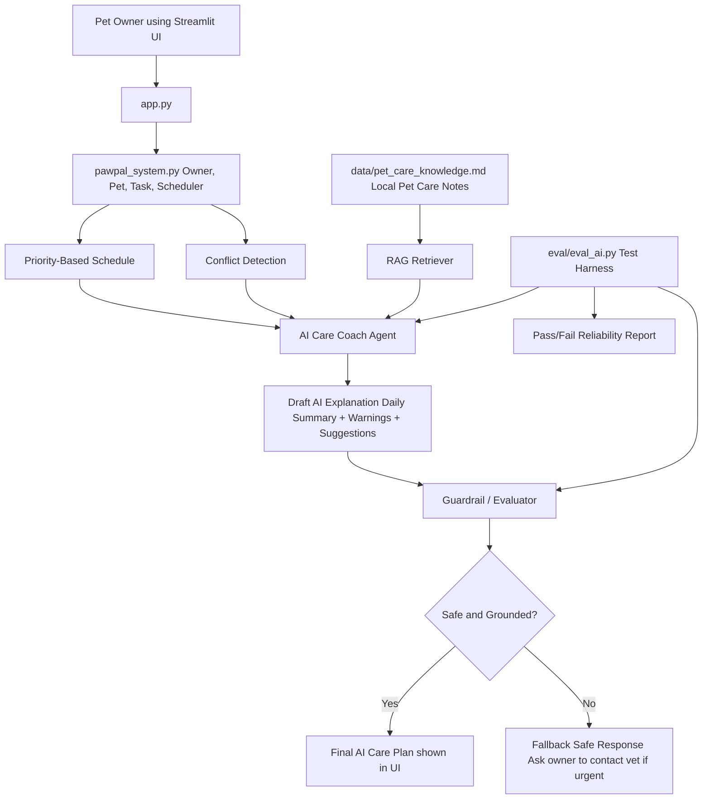

```mermaid
flowchart TD
    A[Pet Owner using Streamlit UI] --> B[app.py]
    B --> C[pawpal_system.py Owner, Pet, Task, Scheduler]
    C --> D[Priority-Based Schedule]
    C --> E[Conflict Detection]
    D --> F[AI Care Coach Agent]
    E --> F
    G[data/pet_care_knowledge.md Local Pet Care Notes] --> H[RAG Retriever]
    H --> F
    F --> I[Draft AI Explanation Daily Summary + Warnings + Suggestions]
    I --> J[Guardrail / Evaluator]
    J --> K{Safe and Grounded?}
    K -->|Yes| L[Final AI Care Plan shown in UI]
    K -->|No| M[Fallback Safe Response Ask owner to contact vet if urgent]
    N[eval/eval_ai.py Test Harness] --> F
    N --> J
    N --> O[Pass/Fail Reliability Report]
```
