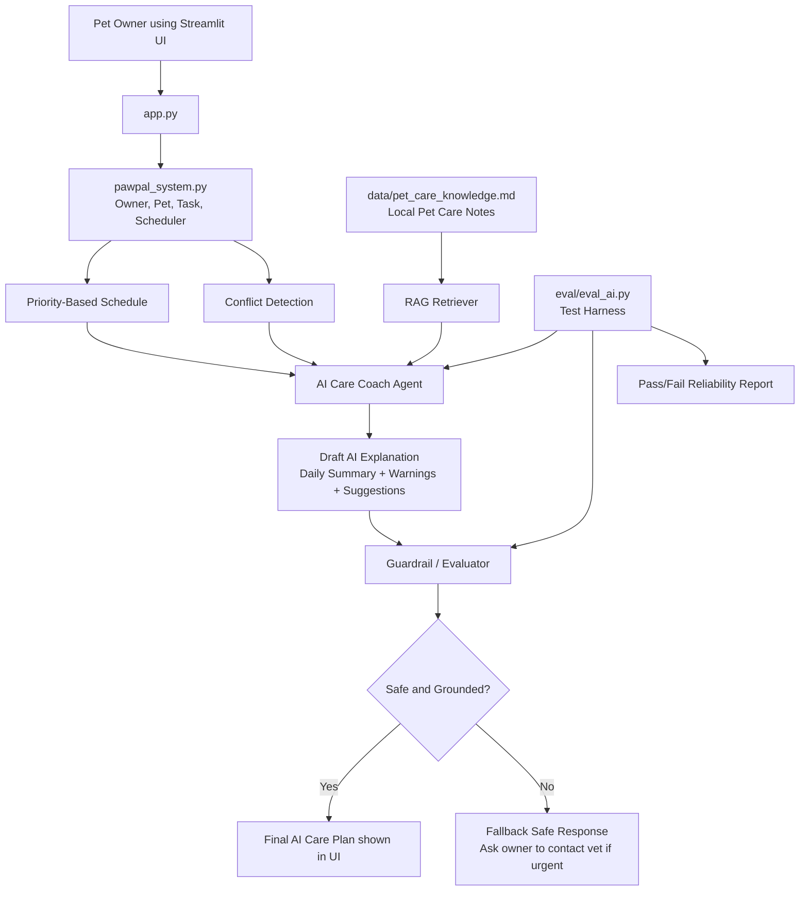

```mermaid
flowchart TD
    A[Pet Owner using Streamlit UI] --> B[app.py]
    B --> C[pawpal_system.py<br/>Owner, Pet, Task, Scheduler]

    C --> D[Priority-Based Schedule]
    C --> E[Conflict Detection]

    G[data/pet_care_knowledge.md<br/>Local Pet Care Notes] --> H[RAG Retriever]

    D --> F[AI Care Coach Agent]
    E --> F
    H --> F

    N[eval/eval_ai.py<br/>Test Harness] --> F
    N --> J
    N --> O[Pass/Fail Reliability Report]

    F --> I[Draft AI Explanation<br/>Daily Summary + Warnings + Suggestions]
    I --> J[Guardrail / Evaluator]
    J --> K{Safe and Grounded?}
    K -->|Yes| L[Final AI Care Plan shown in UI]
    K -->|No| M[Fallback Safe Response<br/>Ask owner to contact vet if urgent]
```
